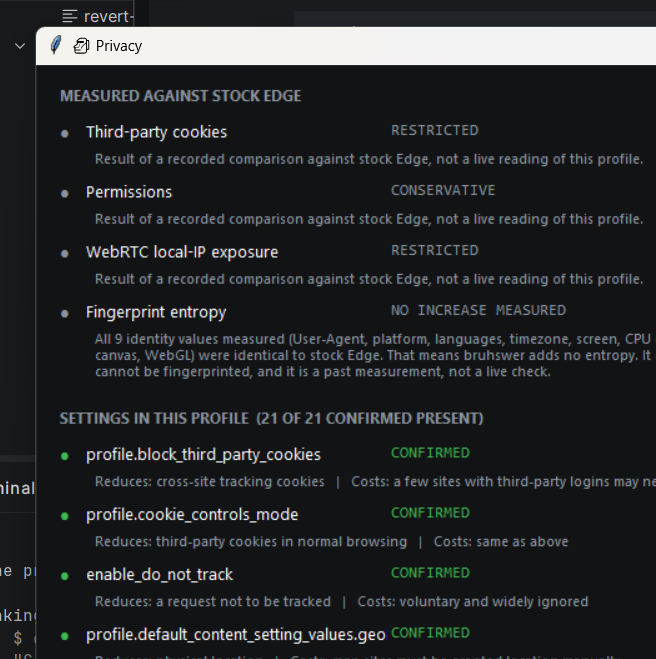

<p align="center">
  
</p>

<p align="center">
  <strong>A measured, fail-closed security wrapper around Microsoft Edge on Windows.</strong>
</p>

<p align="center">
  <sub>Browse the internet. Trust absolutely nothing - including this.</sub>
</p>

<p align="center">
  <a href="#what-it-actually-does">What it does</a> ·
  <a href="#what-it-does-not-do">What it can't</a> ·
  <a href="docs/ARCHITECTURE.md">Architecture</a> ·
  <a href="docs/SECURITY-MODEL.md">Security model</a> ·
  <a href="docs/LIMITATIONS.md">Limitations</a> ·
  <a href="docs/TESTING.md">Testing</a> ·
  <a href="#install">Install</a>
</p>

<p align="center">
  
  
  
  
  
  
  
</p>

---

## 🗿 So what is this

bruhswer runs Microsoft Edge inside a set of controls it **verifies before it will let
the browser start**, and refuses to launch if any of them cannot be proved. (it's a
wrapper. i know a wrapper sounds bad but hear me out here)

|  |  |
|---|---|
| **What it is** | One unelevated Python process that launches Edge, hosts Edge's real window in its own frame, and measures a fixed set of security properties on every launch |
| **What it protects** | Your router and LAN from the browser · your Downloads folder from downloads · your Edge profile from persisting when you didn't ask it to · your PC from bruhswer itself, which has no network client and no listener |
| **How** | A program-scoped Windows Firewall rule, a confined profile with real ACL probes, a quarantine directory, and a single fail-closed decision point that will not accept `UNKNOWN` as `PASS` |
| **What it can't** | Filter loopback - Windows Firewall does not. Sandbox the browser process. Isolate anything in a VM. Make you anonymous. It reports each of these as `NOT ENFORCEABLE` rather than showing green ([the full list](docs/LIMITATIONS.md)) |

It is **not** a secure browser, a VM, a sandbox or a privacy product, and it never
claims to be any of them.

### Why it exists

Because "secure browser" usually means a normal browser with a marketing page.

The interesting question isn't *"is it secure?"* - that's unanswerable. It's
**"which specific things did you actually verify, and how?"**

> **If I can't prove it, the software says `UNKNOWN`.**

That rule is the whole project. Every green light in bruhswer traces to a measurement
taken on the running system, and where the measurement says the control does not hold,
the UI says so in the user's face rather than quietly rounding up.

### Where to look

| | |
|---|---|
| [`docs/ARCHITECTURE.md`](docs/ARCHITECTURE.md) | How it is built, as it actually ships |
| [`docs/SECURITY-MODEL.md`](docs/SECURITY-MODEL.md) | Threat model, guarantees, non-guarantees, verdict semantics |
| [`docs/LIMITATIONS.md`](docs/LIMITATIONS.md) | Measured platform boundaries - the honest part |
| [`docs/TESTING.md`](docs/TESTING.md) | What the 146 assertions actually prove, and what they can't |
| [`docs/SECURITY-TESTING.md`](docs/SECURITY-TESTING.md) | If you want to attack it: scope, safe harbour, what's already known |
| [`docs/research/`](docs/research/) | Three isolation backends built, measured and rejected. History, not guidance |

---

## What it looks like

<p align="center">
  
</p>

<p align="center">
  <em>A real Edge window, hosted inside bruhswer's frame. Real tabs, real navigation - not a fake shell around a WebView.</em>
</p>

### The panels

<table>
<tr>
<td width="50%" align="center">
  <br>
  <strong>🚧 Network</strong><br>
  <sub>Green where it's genuinely enforced.<br><strong>Amber and honest</strong> where it isn't.</sub>
</td>
<td width="50%" align="center">
  <br>
  <strong>🗿 BRUH CHECK</strong><br>
  <sub>Every verdict measured from the live system,<br>including the renderer sandbox.</sub>
</td>
</tr>
</table>

<p align="center">
  
</p>

<p align="center">
  <em><strong>🕵️ Privacy</strong> - note "21 of 21 <strong>confirmed present</strong>". These are read back out of the profile,<br>not listed because we intended them. And the older comparison results say plainly that they are<br>a past measurement, not a live reading.</em>
</p>

---

## What it actually does

Everything below is **measured on real hardware**, not inferred from documentation.

| | Control | Status |
|---|---|---|
| 🔒 | **Fail-closed startup** - no browser if critical checks don't pass. No "continue anyway" button. | Verified |
| 🚧 | **Router and LAN blocked** - a program-scoped Windows Firewall rule. Internet keeps working. | Measured |
| 🛡️ | **Browser can't undo it** - the browser's own token cannot create, delete or disable those rules. | Measured |
| 📦 | **Download quarantine** - files land in bruhswer's folder, never your Downloads. Nothing is executed. | Measured |
| 🗑️ | **Disposable sessions** - fresh profile, destroyed on close, downloads included, deletion verified. ([one caveat](#-edge-signs-itself-in-and-bruhswer-cannot-stop-it)) | Verified |
| 🕵️ | **Privacy settings** - written into the profile and **read back** to confirm they stuck. | Verified |
| 🏠 | **Host Guard** - tells you what other devices on the Wi-Fi can reach on *your* PC. | Verified |
| ✍️ | **Signed browser only** - Edge's Authenticode signature is checked on every launch. | Verified |
| 🚫 | **No telemetry** - bruhswer contains no network client. None. It cannot phone home. | By construction |

### The two ideas underneath

**1. A verdict you didn't measure is a lie.**
Every status has four possible values, and three of them are uncomfortable:

```
PASS              measured, and it holds
FAIL              measured, and it doesn't
NOT ENFORCEABLE   we know it's open, and no setting we have can close it
UNKNOWN           we couldn't find out, and we won't guess
```

A check that used to be a hardcoded `PASS` quoting an old measurement is now measured
live from the running processes - because on the same machine, a different browser's
renderers behaved differently. Build-dependent facts get measured, not asserted.

**2. bruhswer adds no attack surface of its own.**
No HTTP server. No localhost API. No IPC socket. No named pipe. No DevTools port. No
remote debugging. The UI and the controller live in one process and call each other
directly, so there is nothing to authenticate and nothing to get wrong.

This isn't a promise in a doc - a test parses the source and fails the build if
anything ever imports `socket`, `http.server`, `asyncio` or `flask`, calls `listen`,
or opens a named pipe.

---

## What it does **not** do

Read this part twice. It is the part most projects leave out.

> ### ⚠️ Localhost is reachable. bruhswer cannot stop it.
>
> Windows Firewall **does not filter loopback traffic**. No rule, no setting, no
> configuration changes this.
>
> A malicious page in bruhswer can reach services running on your own PC - your dev
> server, your database admin panel, anything listening on `127.0.0.1`.
>
> We measured **19 different ways** in and every single one got through: `localhost`,
> `127.0.0.1`, `127.0.0.2`, the decimal (`2130706433`) and hex (`0x7f000001`) forms,
> IPv6 `[::1]`, the machine's own LAN address - via top-level navigation, and via
> page-driven `fetch`, `POST` and WebSocket.
>
> bruhswer reports this as `NOT ENFORCEABLE` everywhere you can see it, and a
> regression test **fails the build** if it is ever described as anything else.

> ### 🪪 Edge signs itself in, and bruhswer cannot stop it
>
> On a windowed launch, **Edge automatically signs a brand-new profile into your
> Windows Microsoft account** - including a disposable one. Measured on a fresh
> profile: the account record (email, name, account id) was written within seconds,
> the synced favourites appeared, and sync consent was recorded.
>
> bruhswer passes `--disable-sync`, which **stops the syncing** - measured, sync
> consent no longer recorded. It does **not** stop the sign-in, and no command-line
> switch does. The only thing that does is machine-wide Edge policy, which would
> change every Edge profile on your PC - broader than bruhswer is allowed to be.
>
> **So a disposable session is fresh and throwaway. It is not anonymous.** Your
> identity is attached to it unless you sign out inside the session
> (**Settings → Profiles**). bruhswer measures this at every launch and shows it as
> `NOT ENFORCEABLE` - it never shows green while an account is signed in.
>
> This one was found by taking a screenshot for this README. Which is rather the
> point: automated evidence is not the same as looking at the thing.

And the rest, plainly:

- ❌ **Not a virtual machine.** No VM isolation. It never claims any.
- ❌ **The browser process is not sandboxed.** Chromium's sandbox contains *renderers*.
  The browser process runs on an ordinary user token. Measured.
- ❌ **No VPN.** Reports `UNSUPPORTED` rather than implying one exists.
- ❌ **DNS encryption is `UNKNOWN`.** A local resolver sits in the path here, and
  confirming it would need a packet-capture driver this project won't install. So it
  says `UNKNOWN` instead of guessing.
- ❌ **IPv6 is only partly verified.** What was testable was tested; the rest says so.
- ❌ **Not anonymity.** It reduces what sites collect. It does not make you unique-proof,
  and it deliberately avoids fingerprint spoofing, because a browser lying about its
  screen size is *rarer* than one telling the truth - and rarity is what tracking eats.
- ❌ **Not malware protection.** Quarantine means a file wasn't let out. It does not
  mean the file is safe. bruhswer will never tell you a file is safe.
- ❌ **Cannot save a compromised PC.** It runs as you. Anything else running as you
  can read what it can read.

---

## Release status

**v0.9.0 - research-grade beta. Deliberately, not accidentally.**

The controls it claims are measured and the suite passes. What keeps it below `1.0.0`
is not unfinished code, it is unfinished *evidence*:

| Blocking 1.0.0 | Why it matters |
|---|---|
| Releases are unsigned | No code-signing certificate exists, and self-signing one to look official would be the exact behaviour this project exists to complain about |
| Builds are not reproducible | You cannot currently verify that the published installer was built from the published source |
| No third-party audit | Every measurement here was taken by the author. That is a real limitation of the evidence, not a formality |
| Edge-version compatibility is untested | Its guarantees rest on Edge internals that Microsoft can change without notice |

Until those close, treat bruhswer as a security *research* tool that happens to be
usable daily, not as a product you should stake anything on. The
[roadmap](docs/ROADMAP.md) tracks each item, and the
[release checklist](docs/RELEASE-CHECKLIST.md) is what every release has to survive.

---

## Install

### The easy way

Grab the installer from [Releases](../../releases), check the SHA-256 against the
published checksum, and run it.

It installs to your own user folder, needs **no Administrator**, and creates no
service, no scheduled task, no background updater and no startup entry.

> **The release is unsigned.** SmartScreen will warn you about an unrecognised
> publisher, and it's right to. There's no code-signing certificate for this project,
> and self-signing one to look official would be exactly the sort of thing this README
> is otherwise complaining about. Verify the checksum.

### From source

```powershell
git clone https://github.com/Codex-Crusader/bruhswer-the-homebrew-pseudo-browser
cd bruhswer\bruhswer
python bruhswer.py
```

**Needs:** Windows 10/11 · Python 3.11+ · Microsoft Edge

No pip install. No dependencies. bruhswer uses the standard library only - every
package you add is a package someone has to trust.

### Turn on network protection

This is the one step that needs Administrator, because changing your firewall is a
real change to your PC. It stays separate and reversible on purpose:

```powershell
# In an Administrator PowerShell
.\tools\bruhswer-netpolicy.ps1 -Action apply     # blocks router + LAN for Edge
.\tools\bruhswer-netpolicy.ps1 -Action status    # what's in place right now
.\tools\bruhswer-netpolicy.ps1 -Action remove    # undo it, completely
```

Until you do, bruhswer **won't launch the browser** - and it will tell you exactly
which check failed. That's not a bug.

> 💡 On a hotel or airport Wi-Fi with a sign-in page, these rules can block the
> sign-in page too. Turn policy off, sign in, turn it back on.

---

## Using it

```powershell
python bruhswer.py              # the browser
python bruhswer.py --check      # run every verification, print it, no UI
python bruhswer.py --hostguard  # what the laptop at the next table can reach
python bruhswer.py --panel      # the control panel, without a browser
python bruhswer.py --uninstall  # show and remove everything bruhswer left behind
```

### Persistent vs disposable

|  | **Persistent** | **Disposable** |
|---|---|---|
| Profile | Kept between sessions | Fresh, empty, thrown away |
| Cookies & logins | Survive | Gone on close |
| Downloads | Stay in quarantine | **Destroyed with the session** |
| Good for | Your normal browsing | That one sketchy link |

Closing a disposable session with files in quarantine gives you a warning listing
exactly what's about to be deleted, so you can export first. It won't quietly bin
your download.

### Downloads

Everything lands in `%LOCALAPPDATA%\BRUHWSER\quarantine\`. The browser is configured
not to ask where to save, so a hostile page can't steer a download somewhere useful
to it. Executable types are flagged as programs - **and not run**.

Getting a file out is a deliberate act: you pick the destination in bruhswer's own
folder picker, and bruhswer rebuilds the filename from scratch. The name the website
supplied is treated as hostile text, never as a path.

### Host Guard

The other direction. Not *"what can a website reach?"* but *"what can the laptop at
the next table reach?"*

It finds things like File and Printer Sharing left on for Public networks, or SMB
signing switched off - then **explains the fix and waits**. It never changes your PC
on its own, every fix is scoped as narrowly as it can be, and every one has a
recorded rollback.

---

## The honest bit

<table>
<tr><td>

**146** assertions across **7** suites, all passing, run repeatedly, zero known
flaky tests. Against a real browser, a real firewall and a real network - not mocks.

</td></tr>
</table>

| | |
|---|---|
| 🟢 **PASS** | measured, and it holds |
| 🔴 **FAIL** | measured, and it doesn't |
| 🟡 **NOT ENFORCEABLE** | we know it's open, and nothing we have can close it |
| ⚪ **UNKNOWN** | we couldn't find out, and we won't guess |

Some things this project found in its *own* code, and fixed:

- The download directory was set with `--download-directory=`, **which is not a real
  Chromium switch.** Edge ignored it and files went to the user's real Downloads
  folder. Every test still passed, because no test had ever downloaded anything. It's
  a preference now, and it's read back and verified at every launch.
- Destroying a disposable session deleted the profile and reported *"destroyed and
  verified gone"* - while leaving **every file downloaded during that session on disk
  forever**, invisible to the UI. Now they go with it, after warning you.
- The renderer sandbox check was a hardcoded `PASS` quoting a measurement from one
  machine. It's measured from the live processes now.
- `icacls /inheritance:r` with `/T` silently made the profile unreadable while
  returning exit code 0. There's a real read/write probe after it now, because a
  zero exit code is not evidence.
- **Edge was signing disposable profiles into the user's Microsoft account.** Found
  while taking the screenshots above. `--disable-sync` now stops the syncing; the
  sign-in itself is reported as `NOT ENFORCEABLE` because nothing in scope can stop it.
- `.gitignore` had an unanchored `downloads/` that matched `app/downloads/` - the
  published repo would have been missing `quarantine.py` and wouldn't have imported.
  Two models read that file and called it clean; `git check-ignore` found it in
  seconds.

Each one was a green light nobody had verified. That's the defect class this project
treats as a vulnerability - including in itself.

**Full detail:** [SECURITY-MODEL.md](docs/SECURITY-MODEL.md) ·
[LIMITATIONS.md](docs/LIMITATIONS.md) ·
[TESTING.md](docs/TESTING.md) ·
[ARCHITECTURE.md](docs/ARCHITECTURE.md) ·
[NETWORK-PRIVACY.md](docs/NETWORK-PRIVACY.md) ·
[DATA-INVENTORY.md](docs/DATA-INVENTORY.md) ·
[RELEASE-CANDIDATE.md](docs/RELEASE-CANDIDATE.md)

---

## Your data

Everything the **app** writes lives in one place - `%LOCALAPPDATA%\BRUHWSER\` - and
nowhere else. No `ProgramData`, no scheduled tasks, no service, no startup entry. (The
*installer*, if you use it, also makes the ordinary per-user uninstall registration and
the shortcuts you asked for, so bruhswer shows up in "Installed apps" like anything
else. Both go on uninstall.)

**bruhswer adds no encryption of its own - as a trade-off, not because encryption is
pointless.** Against a compromised browser process or malware running as you, DPAPI
would add nothing: those hold your token, so the data is decrypted for them on request.
Against someone who steals the powered-off disk it genuinely *would* help, and an
earlier draft of this README wrongly said otherwise.

The reason bruhswer still doesn't is simpler: the valuable data is Edge's **live**
profile, which Edge must read and write continuously. bruhswer can't wrap that in its
own encryption without breaking the browser - and Edge already DPAPI-protects the
sensitive fields inside it. If disk theft is your worry, **turn on BitLocker**; that's
the control that actually covers it.

What protects it today: Windows per-user file permissions (the persistent profile
additionally has inheritance stripped and is granted only to `SYSTEM` and you), plus
BitLocker if you have it on. Full reasoning, including the correction:
[DATA-INVENTORY.md](docs/DATA-INVENTORY.md).

Logs record verdicts, check IDs and rule names. Never URLs, cookies, form data or
history - and the formatter redacts anything that looks like one anyway, because
"the caller shouldn't have done that" is not a control.

---

## Contributing

Issues and pull requests welcome. Two house rules, both non-negotiable:

1. **No unverified claims.** If you add a control, add the test that proves it. If it
   can't be proven on the platform, it says `NOT ENFORCEABLE` or `UNKNOWN` - and
   that's a perfectly good outcome, not a failure.
2. **No new dependencies** without a genuinely strong case. Standard library only.
   Every package added is a package a user has to trust.

Found a security problem? **Don't open a public issue.** See
[SECURITY.md](SECURITY.md) - use GitHub's private vulnerability reporting.

### Security researchers

There's a guide written for you: **[docs/SECURITY-TESTING.md](docs/SECURITY-TESTING.md)**.
It has the trust-boundary map, every place untrusted input enters the code, how to set
up and tear down a test environment, safe harbour, a report template - and a table of
**what's already known**, so you don't spend a weekend rediscovering a documented
platform limitation. It also lists things previously tried that didn't work, which is
usually the part nobody writes down.

Where the project is going, and what it refuses to do:
[docs/ROADMAP.md](docs/ROADMAP.md).

```powershell
python tests\run_all.py    # the full suite (needs network policy applied)
```

---

## Licence

[Apache-2.0](LICENSE).

---

<p align="center">
  <sub>
    bruhswer holds no security certification and has had no third-party audit.<br>
    It reduces what a website can reach and learn. It does not make you immune to anything.<br><br>
    <strong>🗿 When it can enforce something, it enforces it.<br>
    When it can't, it says so.</strong>
  </sub>
</p>
