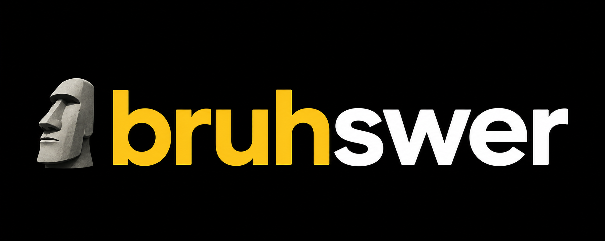
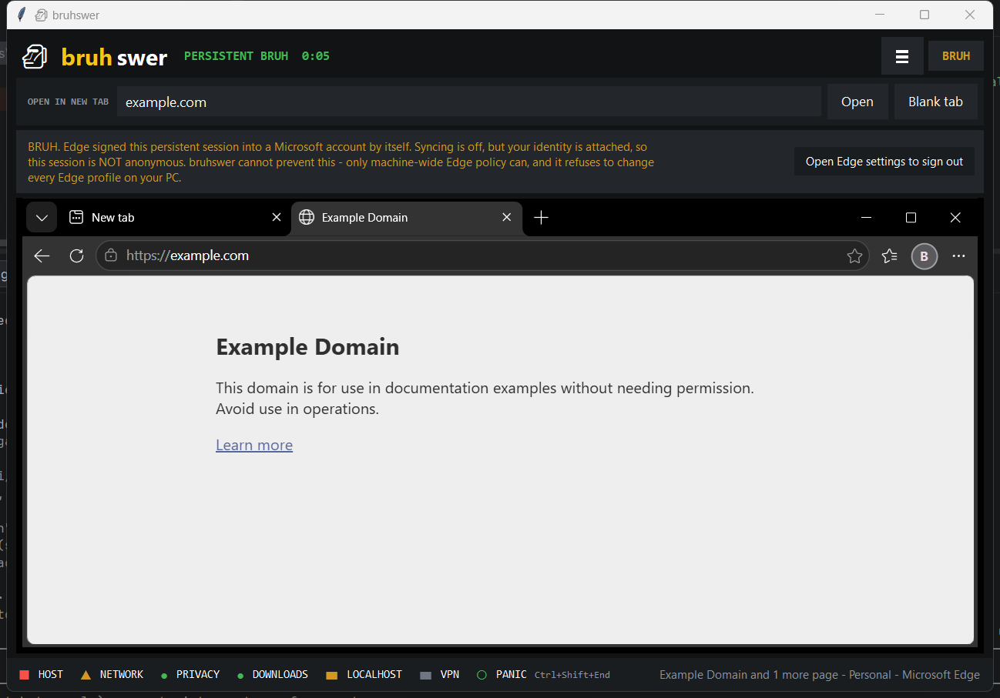
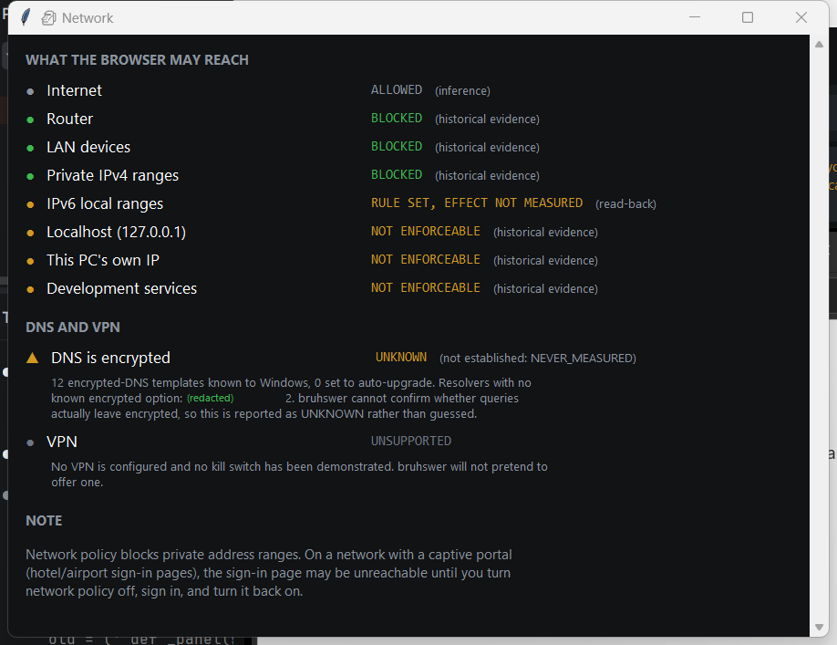
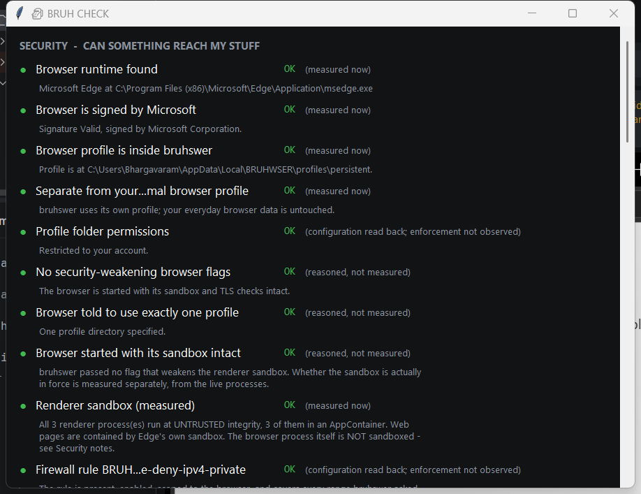

<p align="center">
  
</p>

<p align="center">
  <strong>A measured, fail-closed security wrapper around Microsoft Edge on Windows.</strong>
</p>

<p align="center">
  <sub>Browse the internet. Trust absolutely nothing - including this.</sub>
</p>

<p align="center">
  
  
  
  
  
  
  
</p>

---
> **Written up in full:** [codex-crusader.github.io/projects/bruhswer/](https://codex-crusader.github.io/projects/bruhswer/) covers the problem, the architecture, the results and what it deliberately does not do.


bruhswer launches Microsoft Edge inside a set of security controls it **verifies before
it will let the browser start**, and refuses to launch if any of them cannot be proved.

Every green light traces to a measurement taken on your running system. Where a control
cannot be verified, it says so instead of rounding up.

> **If it can't be proved, the software says `UNKNOWN`.**
>
> That one rule is the whole project.

<sub>Special thanks to Claude for helping me with the documentation. I do not know how I
could have explained it to you without him.</sub>

<p align="center">
  
</p>

<p align="center">
  <em>A real Edge window hosted inside bruhswer's frame - real tabs, real navigation.<br>
  The amber banner is bruhswer reporting something it <strong>cannot</strong> fix.</em>
</p>

---

## The whole security model, on one screen

```
                                 VERDICT            EVIDENCE
Router / LAN access              PASS               earlier measurement + read-back
Download quarantine              PASS               read-back of the profile setting
Disposable session destroyed     PASS               measured now, deletion verified
Profile confinement              PASS               measured now, ACL applied + probed
Browser signature                PASS               measured now, every launch
Renderer sandbox                 PASS               measured now, from live processes

Localhost / loopback             NOT ENFORCEABLE    Windows Firewall cannot filter it
Microsoft account sign-in        NOT ENFORCEABLE    no command-line switch stops it
IPv6 rule effect                 UNKNOWN            rule is set, effect never measured
DNS encryption                   UNKNOWN            needs a capture driver we won't install
VPN                              UNSUPPORTED        not built, not pretended
```

The **EVIDENCE** column is the point, and bruhswer shows it next to every verdict in its
own UI. `PASS` answers *did the check succeed*. It does not answer *how does bruhswer
know*, and those come apart:

| Evidence | Means | Does **not** mean |
|---|---|---|
| **measured now** | bruhswer observed the property itself, this pass | (nothing - this is the strongest kind) |
| **read-back** | it read a setting back from Windows or the profile | that the setting is being enforced |
| **earlier measurement** | an experiment established it once, on this hardware | that it was re-run this session |
| **reasoned** | derived from other facts | that anything was measured |

<table>
<tr>
<td width="50%" align="center">
  <br>
  <strong>Network</strong><br>
  <sub>Green only where it is genuinely enforced.<br>Amber and honest where it is not.</sub>
</td>
<td width="50%" align="center">
  <br>
  <strong>BRUH CHECK</strong><br>
  <sub>Every verdict carries the kind of<br>evidence behind it.</sub>
</td>
</tr>
</table>

---

## What it does

| | Control |
|---|---|
| 🔒 | **Fail-closed startup.** No browser if critical checks don't pass. No "continue anyway" button |
| 🚧 | **Router and LAN blocked** by a program-scoped firewall rule. The internet keeps working |
| 🛡️ | **The browser can't undo it.** An unelevated Edge process could not add, remove or disable those rules |
| 📦 | **Download quarantine.** Nothing lands in your Downloads folder, and nothing is ever executed |
| 🗑️ | **Disposable sessions.** Fresh profile, destroyed on close, downloads included, deletion verified |
| 🕵️ | **Privacy settings written and read back** to confirm they actually stuck |
| 🏠 | **Host Guard** tells you what the laptop at the next table can reach on *your* PC |
| ✍️ | **Signed browser only.** Edge's Authenticode signature is checked on every launch |
| 🔁 | **Re-checked while you browse.** A control that stops holding downgrades its own light |
| ⏱️ | **Panic key.** `Ctrl+Shift+End` kills *this session's* browser. Never touches your own Edge |
| 🔗 | **Address sanitising.** Invisible and direction-reversing URLs are refused, not quietly cleaned |
| 🚫 | **No telemetry.** There is no network client in the codebase. It cannot phone home |

**It adds no attack surface of its own.** No HTTP server, no localhost API, no IPC
socket, no named pipe, no DevTools port. The UI and the controller are objects in one
process that call each other directly, so there is nothing to authenticate and nothing
to get wrong. A test parses the source and fails the build if that ever changes.

---

## What it can't do

Read this part. It is the part most projects leave out.

- **Localhost is reachable, and bruhswer cannot stop it.** Windows Firewall does not
  filter loopback. 19 different routes in were tested and every one got through. It is
  reported as `NOT ENFORCEABLE` everywhere you can see it.
- **A disposable session is fresh, but not anonymous.** Edge signs a brand-new profile
  into your Microsoft account by itself. `--disable-sync` stops the syncing; nothing in
  scope stops the sign-in. bruhswer measures it and shows it rather than hiding it.
- **The browser process is not sandboxed.** Chromium's sandbox contains *renderers*. The
  browser process runs on an ordinary user token.
- **It is not a VM, not anonymity, and not malware protection.** Quarantine means a file
  was not let out. It never means a file is safe.

Every one of these, with the measurements behind it:
**[docs/LIMITATIONS.md](docs/LIMITATIONS.md)**

---

## Install

Grab the installer from [Releases](../../releases), check the SHA-256 against the
published checksum, and run it. It installs to your user folder, needs no Administrator,
and creates no service, no scheduled task and no background updater.

You can also check which commit and workflow built it, without trusting the checksum
line to have been written honestly:

```powershell
gh attestation verify bruhswer-0.12.0-setup.exe `
  --repo Codex-Crusader/bruhswer-the-homebrew-pseudo-browser
```

That proves the binary came from this repository's own CI, from a named commit. It is
not a reproducible build - you still cannot rebuild it yourself and compare - and it
is not code signing.

> **The release is unsigned.** SmartScreen will warn you about an unrecognised
> publisher, and it is right to. Verify the checksum.

Or from source - Windows 10/11, Python 3.11+, Microsoft Edge:

```powershell
git clone https://github.com/Codex-Crusader/bruhswer-the-homebrew-pseudo-browser
cd bruhswer\bruhswer
python bruhswer.py
```

No pip install. No dependencies. Standard library only.

### Turn on network protection

The one step that needs Administrator, kept separate and reversible on purpose:

```powershell
.\tools\bruhswer-netpolicy.ps1 -Action apply     # blocks router + LAN for Edge
.\tools\bruhswer-netpolicy.ps1 -Action status    # what's in place right now
.\tools\bruhswer-netpolicy.ps1 -Action remove    # undo it, completely
```

Until you do, bruhswer **will not launch the browser**, and it will tell you exactly
which check failed. That is not a bug.

> 💡 On hotel or airport Wi-Fi, these rules can block the sign-in page too. Turn policy
> off, sign in, turn it back on.

---

## Using it

```powershell
python bruhswer.py              # the browser
python bruhswer.py --check      # run every verification, print it, no UI
python bruhswer.py --hostguard  # what the laptop at the next table can reach
python bruhswer.py --panel      # the control panel, without a browser
python bruhswer.py --uninstall  # show and remove everything bruhswer left behind
```

|  | **Persistent** | **Disposable** |
|---|---|---|
| Profile | Kept between sessions | Fresh, empty, thrown away |
| Cookies & logins | Survive | Gone on close |
| Downloads | Stay in quarantine | **Destroyed with the session** |
| Good for | Your normal browsing | That one sketchy link |

Closing a disposable session with files in quarantine warns you first and lists exactly
what is about to go, so you can export it. It will not quietly bin your download.

---

## Documentation

| | |
|---|---|
| [Architecture](docs/ARCHITECTURE.md) | How it is built, as it actually ships |
| [Security model](docs/SECURITY-MODEL.md) | Threat model, guarantees, non-guarantees, verdict semantics |
| [Limitations](docs/LIMITATIONS.md) | Every measured boundary - the honest part |
| [Testing](docs/TESTING.md) | What the 322 assertions prove, and what they missed |
| [Security testing](docs/SECURITY-TESTING.md) | If you want to attack it: scope, safe harbour, what's already known |
| [Network & privacy](docs/NETWORK-PRIVACY.md) · [Data inventory](docs/DATA-INVENTORY.md) | What leaves the machine, and what is stored where |
| [Roadmap](docs/ROADMAP.md) | What is planned, and what is refused |
| [Research](docs/research/) | Three isolation backends built, measured and rejected. History, not guidance |
| [Contributing](CONTRIBUTING.md) | Two house rules, both non-negotiable |

---

## Status

**v0.12.0 - research-grade beta, deliberately.** The controls it claims are measured and
322 assertions across 17 suites pass against a real browser, a real firewall and a real
network. What keeps it below 1.0 is not unfinished code, it is unfinished *evidence*:
releases are unsigned, builds are not reproducible, and every measurement here was taken
by the author with no third-party audit. The [roadmap](docs/ROADMAP.md) tracks each one.

Treat it as a security research tool that happens to be usable daily.

## Licence

[Apache-2.0](LICENSE). Found a security problem? Do not open a public issue - see
[SECURITY.md](SECURITY.md).

---

<p align="center">
  <sub>
    bruhswer holds no security certification and has had no third-party audit.<br>
    It reduces what a website can reach and learn. It does not make you immune to anything.<br><br>
    <strong>🗿 When it can enforce something, it enforces it.<br>
    When it can't, it says so.</strong>
  </sub>
</p>
